# Beacon System Flow Diagram

## High-Level Architecture

```mermaid
graph TB
    User[👤 User] --> CLI[🖥️ Beacon CLI]
    CLI --> Proxy[🌐 Proxy Server :3001]
    Proxy --> Claude[🤖 Anthropic Claude API]
    CLI --> LocalFS[💾 Local File System]
    Proxy --> Logs[📊 Winston Logs]
    
    subgraph "CLI Process"
        CLI --> APIClient[API Client]
        APIClient --> LocalFile[Local File Service]
        APIClient --> Prompts[Inquirer Prompts]
    end
    
    subgraph "Proxy Server"
        Proxy --> ChatRoutes[Chat Routes]
        Proxy --> FileRoutes[File Routes]
        Proxy --> BatchRoutes[Batch Routes]
        Proxy --> Cache[Response Cache]
        ChatRoutes --> AnthropicService[Anthropic Service]
    end
    
    subgraph "File Operations"
        LocalFile --> Create[📄 Create]
        LocalFile --> Read[📖 Read]
        LocalFile --> Update[✏️ Update]
        LocalFile --> Delete[🗑️ Delete]
    end
```



## Detailed Connection Flow

### 1. CLI Startup & WebSocket Registration


### 2. Chat Request Processing


### 3. Streaming Response Flow


### 4. WebSocket-Based File Operation Delegation


### 5. Yocto Project Creation Flow


### 6. Error Handling & Retry Logic

```mermaid
sequenceDiagram
    participant CLI as Beacon CLI
    participant API as ApiClient
    participant PS as Proxy Server
    participant RL as Rate Limiter
    
    CLI->>API: makeRequest()
    
    loop Retry attempts (max 3)
        API->>PS: HTTP request
        
        alt Rate limited (429)
            PS->>RL: Check rate limit
            RL->>PS: Rate limit exceeded
            PS->>API: 429 Too Many Requests
            API->>API: wait(retryDelay * 2^attempt)
        else Connection refused
            PS--xAPI: ECONNREFUSED
            API->>API: wait(retryDelay * 2^attempt)
        else Success
            PS->>API: 200 OK response
            break
        else Client error (4xx)
            PS->>API: 4xx Client Error
            break No retry for client errors
        end
    end
    
    alt All retries failed
        API->>CLI: throw Error with helpful message
        CLI->>U: ❌ Error: Cannot connect to proxy server
    else Success
        API->>CLI: Return response
        CLI->>U: Display result
    end
```

## System Components Detail

### CLI Application (Node.js)
- **Entry Point**: `cli/index.js`
- **Main Class**: `BeaconYoctoCLI`
- **Key Features**:
  - Commander.js for CLI parsing
  - Inquirer prompts for interactivity
  - Chalk for colored output
  - Ora for loading spinners

### API Client Layer
- **File**: `cli/services/api-client.js`
- **Responsibilities**:
  - HTTP communication with proxy
  - Retry logic and error handling
  - File operation delegation
  - Streaming response handling

### Proxy Server (Express.js)
- **Entry Point**: `server/index.js`
- **Middleware Stack**:
  1. Helmet (security headers)
  2. CORS (cross-origin requests)
  3. Rate limiting (100 req/min per IP)
  4. Request logging
  5. JSON parsing (10MB limit)

### Route Handlers
- **Chat Routes** (`/api/chat`): AI interactions
- **File Routes** (`/api/files`): File operations
- **Batch Routes** (`/api/batch`): Multiple operations
- **Cache Routes** (`/api/cache`): Cache management

### Local File Service
- **File**: `cli/services/local-file-service.js`
- **Safety Features**:
  - Path traversal protection
  - File size validation
  - Permission checking
  - Error handling

## Data Flow Patterns

### 1. Request/Response Pattern
- CLI → API Client → Proxy Server → Anthropic API
- Synchronous for simple requests
- JSON-based communication

### 2. Streaming Pattern
- Server-Sent Events (SSE) from proxy
- Real-time text and thinking display
- Tool use processing during stream

### 3. Delegation Pattern
- Proxy server delegates file operations to CLI
- Uses global client registration
- Direct filesystem access from CLI

### 4. Caching Pattern
- Response-level caching in proxy
- Key-based cache invalidation
- 1-hour default TTL

## Security & Reliability

### Connection Security
- CORS configuration for allowed origins
- Rate limiting per IP address
- Request size limits (10MB)
- Security headers via Helmet.js

### Error Recovery
- Exponential backoff retry logic
- Graceful degradation for network issues
- Detailed error logging and reporting

### File Operation Safety
- Sandboxed to CLI process only
- Path validation and traversal protection
- No server-side file system access

This architecture provides a robust, secure, and scalable foundation for the Beacon AI-powered Yocto development assistant.